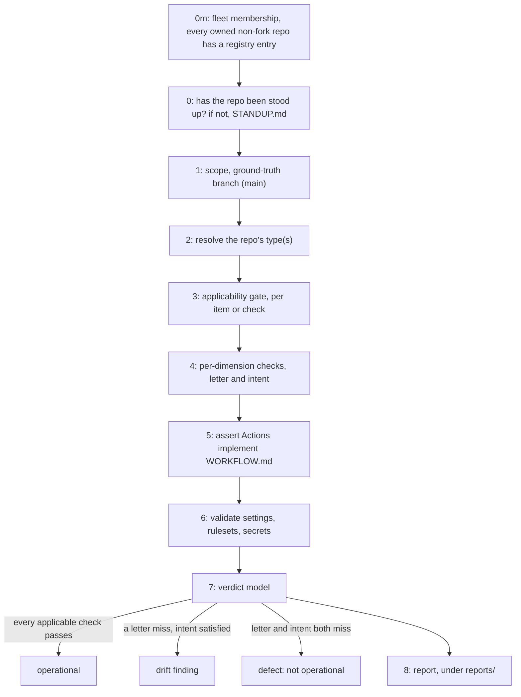
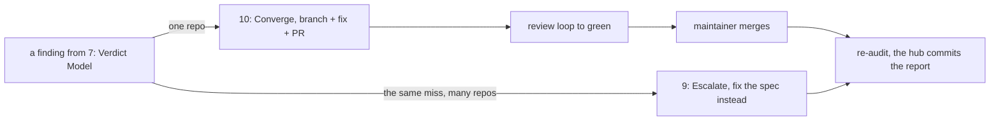

# AUDIT.md

How an agent audits a repository against the fleet ground truth in the hub and reports drift. This is the procedure. The ground truth it checks against is [`registry/repos.json`][repos], the [`spec/`][spec] manifests, [`repo-config/`][repo-config], and the prose authorities ([`GOVERNANCE.md`][governance], [`CODESTYLE.md`][codestyle], [`WORKFLOW.md`][workflow]). The audit is read-only: it produces a report under [`reports/`][reports], never edits the target repo.

The verdict vocabulary is [`WORKFLOW.md`][workflow]'s: **operational / not operational**, **N/A**,
**defect**, and the applicable/absent rule. Do not invent a parallel scheme.

**This file measures. It does not decide the order a finding is applied in.** Section 10 states that converging is a separate phase and how a fix ships, and [`RESYNC.md`][resync] is that phase for a repository that is already stood up and has fallen behind, sequencing the remedies so the rules land before the files they govern and a deletion lands before the re-vendor that would otherwise refresh it.



## 0. When to Run and What "Done" Means

**Start here only if the repo already carries its instruction set.** This file measures a repo against the fleet ground truth, and measuring assumes the thing being measured arrived. A repo holding no carried files, or a partial set, has a baseline that never arrived rather than drift to report, so it goes to [`STANDUP.md`][standup] sections 1A and 2 first and comes back here afterwards. The `AGENTS.md` "Fleet Bootstrap" section states that routing in the repo itself, byte-locked, so an agent finds it without knowing this file exists. Running the audit against a repo with nothing to audit produces a report that is all absences, which reads as a catastrophic result rather than as a repo that was never stood up.

This audit is not occasional. Run it whenever you **create, adopt, or materially change** a fleet repo, and on demand for any known repo:

- **A full sweep opens with a fleet membership check, not a per-repo one.** `spec/audit.py`, run with no repo names, first lists every non-fork repository the registry `owner` actually owns on GitHub and diffs it against `registry/repos.json`. A repo that exists but carries no entry is invisible to every other check in this file, since all of them iterate the registry and never look past it, so this is the only place that gap is caught. The check also reconciles one field: a registry `status: "archived"` must agree with GitHub's own archived flag, in either direction. A name-filtered run or `--issue` skips it, since those are scoped to repos already known to the registry. Run this as `gh auth login` for the owner's own account: a fine-grained PAT scoped to "selected repositories" returns an incomplete list with no error, so the sweep would read clean while some repos were never inspected.
- **Onboarding a repo is complete only when it either passes this audit** (operational on every applicable check) **or carries a committed `reports/<repo>/audit.md` plus a tracking issue** enumerating every residual delta. A repo that is partially set up but never audited is itself a **defect**, the exact state this process prevents. The create-to-conformance counterpart is [`STANDUP.md`][standup]. Because both read the same manifests, a repo stood up by that file passes this audit by construction.
- **Touching a repo** (any conformance-affecting change) ends by re-running the applicable checks and **reconciling the registry entry to reality**: `status`, `types`, `releaseTrigger`, `workflowModel`, `driftNotes`. The registry records reality, not intent. [`spec/validate.py`][validate] proves the catalog is self-consistent, not that it matches the live repo. Closing that gap is this audit's job. The deterministic subset (settings, rulesets, secret names, file presence, per-scope Markdown section presence, workflow interface conformance, verbatim content, hub-hosted files a repo carries, branch facts) is mechanized in [`spec/audit.py`][audit-runner]: owner-initiated, run on demand when onboarding a repo, on suspected drift, or before fleet-wide changes. A required section missing from a carried Markdown file is a **drift finding**, not a letter, because a heading rename reads as missing and equivalence is judged by hand. A carried `interface` workflow (spec/fidelity-model.md) is checked by name and wiring (required jobs, the ruleset-bound check name, the artifact-name handoff, and the forbidden `artifact-ids:` fork), all at **drift**, since the body is owned and a rename is a hint to verify. A carried `verbatim` unit, whether a whole file (`.markdownlint-cli2.jsonc`) or a canonical workflow job region (the `github-release` job), is content-hashed against the hub's canonical after line-ending normalization. A mismatch is classified **stale** (matches a past hub revision, re-vendor) or **modified** (matches none, the repo changed fixed content), both at **drift**, since equivalence is intent-governed and a byte diff is a hint to review. A carried `intent` unit gets one advisory beyond presence, a last-modified comparison: a hub canonical changing after the copy's own last commit marks the copy as possibly trailing, at **drift**, a hint rather than proof, since a copy touched without reconciling reads current and content is never judged. A content scan also looks for a version literal: a three-part version, a full 40-character commit SHA, or an abbreviated one of 7 to 12 characters mixing digits and letters, in `AGENTS.md`, `GOVERNANCE.md`, `CODESTYLE.md`, or `WORKFLOW.md`, outside the verbatim sections downstream and across the whole file in the hub, is a **drift** finding, since a pin's value in prose goes stale at the next bump and every other literal reads like one.

**Verify the host before running any hub tool.** The tools carry version floors, and a host below one answers `--version`, looks healthy, and produces a wrong answer, so a clean audit run from a broken host is a clean-looking result rather than a result.

```shell
python3 scripts/host_gate.py --repo "<path-to-target-checkout>"   # run from a hub checkout, floors from spec/host-tools.json
```

Pass `--repo`, since the gate reads the target's own `host-tools.json` relative to it and defaults to the working directory. Omitting it does not read the target's declaration at all, so every floor that repo adds goes unapplied, and the run reports nothing about the omission. A finding is a **host** misconfiguration rather than a repo one, and [`docs/host-setup.md`][host-setup] is the contract it checks.

## 1. Scope and Ground-Truth Branch

Audit one repository at a time. Read the target's **`main` branch** as ground truth: `main` is the released, authoritative state. Read `develop` only to detect divergence. A stale or diverged `develop` (behind `main`, or diverged) is reported as a **drift finding**, never audited as the truth. Do not treat a `develop`-only file as present if it is absent on `main`.

This holds for **both workflow models**. An `operational` repo commits directly to `develop`, but its ground truth is still `main`, the promoted and gated snapshot the promotion PR blesses. `develop` there is mid-flight by design (ungated direct pushes), so auditing it would measure work in progress: conformance scaffolding that has landed on `develop` but is not yet promoted is *un-promoted work*, not a conformance defect, and it counts when it reaches `main`. A registry `groundTruthBranch` naming `develop` therefore contradicts this section, for either model.

## 2. Resolve the Repo's Type(s)

Look up the repo in [`registry/repos.json`][repos]. An entry with status `archived` or `excluded` is out of scope for the rest of this procedure, so stop here rather than proceeding to section 3. `archived` means GitHub itself reports the repo archived, so no further conformance work applies. `excluded` means a maintainer decision took it out of audit scope, recorded in the entry's `exclusionReason`. Both still carry a registry entry precisely so the decision stays visible, per section 0's membership check, rather than the repo reading as an oversight.

Otherwise read its `types[]`. If the entry is `classificationPending` (a backlog repo), classify it from the tree and propose a registry update:

- `*.csproj` / `*.slnx` -> `csharp`, a `dotnet nuget push` workflow -> `nuget`, a `System.CommandLine` console -> `console`.
- `pyproject.toml` / `setup.py` -> `python`, a `pypa/gh-action-pypi-publish` workflow -> `pypi`.
- `Dockerfile` + a docker build/push workflow -> `docker`, an `upstream-version.json` tracker -> `upstream-wrapper`.
- `custom_components/*/manifest.json` + `hacs.json` -> `homeassistant`, a codegen workflow -> `codegen`, no `build-*` task -> `source-only`, governance-only -> `docs`.
- `hugo.yaml` / `hugo.toml` / `config/_default/hugo.yaml` -> `hugo`. A repo may carry it alongside `source-only`, since a site deploy leaf is not a `build-*` task and both declarations stay true.

## 3. Applicability Gate

Reuse [`WORKFLOW.md`][workflow] section 1, extended to this audit's own checks: an item or check that governs a construct the repo does not contain is **N/A**. Record it as N/A and **exclude it from the verdict**. N/A is never a defect. A Docker check on a repo with no image, a NuGet check on a Python package, and the artifact-lifecycle clauses on a source-only repo are all N/A.

Which carried files and sections a repo is expected to have is decided by its scope selectors (its type(s) plus workflow model, release trigger, and consumer model). The scope model and the `appliesTo` selector vocabulary are defined in [`spec/scope-model.md`][scope-model].

## 4. Per-Dimension Checks (Letter and Intent)

For each applicable type in [`spec/project-types.json`][project-types] and every cross-cutting dimension, evaluate each check at its stated verdict tier:

**Every check under a project type is judged by hand. The cross-cutting dimensions are only partly mechanized, and the line between the two halves is not where a reader assumes.** [`spec/audit.py`][audit-runner] evaluates **no** check belonging to a type in `spec/project-types.json`, and it reads that file for one purpose only, to resolve the id a registry `driftNote` names (section 8) against the catalog and against the repo's declared types. Resolving an id is not running the check it names. What the runner does mechanize is the deterministic subset in section 0, and that subset lands on several `crossCutting` checks without being organized by them: branch protection and the ruleset diffs, secret names, Dependabot ecosystems, the cspell single source, section presence, and `driftNotes` freshness. So read a clean run precisely. It is evidence for that subset, it is **no** evidence for any of a type's checks, and it is partial evidence across the cross-cutting dimensions. The three are easy to conflate, because adding a check under a type changes what an auditor must judge and changes no tool's output, so the check reports nothing until someone evaluates it, and silence from a tool that was never looking reads exactly like a pass. Cite the `file:line` each check was judged against, since that citation is the only durable record that the judgment happened.

- **letter** - the exact file, section, config, or construct is present.
- **intent** - an equivalent outcome holds even if the form differs.

A check with `intentRef`/`workflowRef` points at the prose section that owns the rationale, so read it to judge intent. The dimensions:

- **csharp** - `.editorconfig` carries the shared `[*.cs]` rule block (letter), and analyzer severities are enforced, not relaxed (intent).
- **nuget** - `nuget.publish.oidc` (intent): publish uses OIDC Trusted Publishing with no stored `NUGET_API_KEY` secret, from a job in the publishing repository's own publisher, never inside a build leaf and never in a reusable workflow a different repository hosts, for the reason [`WORKFLOW.md`][workflow] section 3's `Output Seam by Destination` gives for both package registries. `nuget.publish.skipduplicate` (letter): the push carries `--skip-duplicate` and is gated on the publish decision, not on an existence check. `nuget.publish.job` (letter): that publish job declares `id-token: write` and `actions: write`, and consume-then-deletes `nuget-build-<branch>`.
- **pypi** - `pypi.publish.oidc` (intent): OIDC publish with no stored token, from a job in the publishing repository's own publisher under the same seam the **nuget** check names. `pypi.publish.environment` (letter): that job declares `environment: pypi` and `id-token: write`, with `skip-existing: true`.
- **python** - ruff and pyright present (intent), canonical in `pyproject.toml` (letter), and a standalone `.ruff.toml` / `pyrightconfig.json` is a drift finding.
- **dotnet-publish** - `dotnet-publish.smoke.subset` (letter): the smoke runtime matrix is a strict subset of the full set. `dotnet-publish.release.asset` (letter): the per-runtime outputs aggregate to one `release-asset-*`, gated `!smoke`.
- **docker** - registry layer cache (`buildcache-<branch>`, never `type=gha`), the size-limited Docker Hub README is published via the docker-readme task, and the image always re-pushes on publish.
- **hugo** - the build fails on a generator warning, the URL-parity gate asserts a length floor before comparing, the rendered output is untracked, the generator is pinned by version and checksum and declared once, a vendored tree records its upstream ref, and the deploy asserts what the host serves (the release id and the environment). Retention is bounded by a declared count with one side recorded as owning the prune, which is the deploy where its credential can observe the destination and the host where that credential is confined write-only, so grade which shape the repo uses rather than looking for a prune step. Deploy credentials are per-environment, which `spec/secrets.json` cannot express, so a clean **repo-setup** verdict says nothing about whether the environments are configured.
- **branch-model** - `main` and `develop` both exist and are protected, and the live rulesets match [`repo-config/*.json`][repo-config] by normalized diff (below).
- **carried-scope** - the repo carries no file the hub hosts rather than carries. The set is derived, not listed: the hub's git-tracked paths minus the [`spec/files.json`][files] baseline, so a file dropped from the manifest starts being reported on the next run with no retirement list to remember to edit. The remedy is the opposite of every other file finding, a **deletion**, since the repo reaches the hub's copy per [GOVERNANCE.md "Hub-Hosted Tooling"][governance-hub-hosted-tooling]. The match is on path alone, so a hit is a candidate and not a verdict: a repo's own content at a path the hub also uses matches while carrying nothing of the hub's, which the first fleet run showed twice, a KiCad tooling doc at `scripts/README.md` and per-repo formatting hooks at `.husky/pre-commit`. A [`spec/divergences.json`][divergences] `gaps` disposition decides which case a hit is, so only `retire` asserts a deletion, `accepted` closes a collision or a repo-owned file, and an untriaged hit is read before it is acted on.
- **verbatim-tree** - every applicable `trees[]` declaration in [`spec/files.json`][files] owns its target tree. The audit reports missing files as letter findings, stale or modified bytes as drift, and extra files under a pruned target as drift. An unreadable or truncated repository tree is undecided and produces drift rather than a clean result.
- **repo-setup** - every required secret for the repo's publish mechanisms is configured, and no forbidden secret is present (per [`spec/secrets.json`][secrets]).
- **runtime-secrets** - a repo-scoped runtime-secrets directory, when present, is named `.secrets/` (dotted, not a bare `secrets/`), a single opaque credential file carries no extension, and every real secret file has a tracked `<name>.example` beside it cataloged in `.secrets/README.md`. N/A for a repo with no such directory. See [GOVERNANCE.md "Repo-Scoped Secrets"][governance-repo-scoped-secrets].
- **linter-parity** - one config per linter (`.markdownlint-cli2.jsonc`, `cspell.json`, ruff/pyright, editorconfig/csharpier, actionlint) drives the editor extension, the CLI, and CI, and CI runs each. That count is of the root config, so a nested `.markdownlint-cli2.jsonc` is not a second one. A local hook exists and runs at minimum the diff-scoped prose gate and the eol check via `hub-fetch-run.py`, or the hub's own local script copies for the hub repo itself (`parity.hooks`, intent). A repo with none wired is a defect, and one mid-convergence on the language-formatting half stays operational.
- **recurring-violations** - comments concise and non-narrative, ASCII only (no em-dash, no smart quotes), US spelling, line endings per `.editorconfig`. These are frequent regressions, so this dimension is high priority and always runs, and each check is grep-able (see below).
- **readme-structure** - the README follows [`spec/readme-structure.md`][readme-structure] (applicable sections, in order). Mechanically checked against the declared model in [`spec/readme-sections.json`][readme-sections]: required sections present, declared sections in their relative order, `License` last, the shields each deliverable implies, the license shield in the closing License section, and the tagline and its mirrors. A heading the model does not name is dropped before the order comparison, so a repo-specific section is never a finding.

## 5. Assert the Actions Implement WORKFLOW.md

Run [`WORKFLOW.md`][workflow]'s methodology against the repo's **own** Actions, reading a workflow it only calls at the SHA it pins: the 5A static audit (structural facts per applicable D-guarantee, each cited in the form 5A sets out) and the 5B trace scenarios (predicted run/skip + version + release + artifact-end-state vs expected). The contract in WORKFLOW.md section 4 is satisfied by **outcome**, not by matching the catalog snippets in [`catalog/snippets/workflows/`][workflows] byte for byte. Those are the reference implementation, not required bytes. Where a guarantee names a construct, D6.1's `release-asset-<branch>-<target>` and D9.2's ruleset-bound job `name:` among them, that name is the outcome and a divergence is a **defect** here. That is a separate judgment from the `verbatim` content hash section 0 describes, which classifies a mismatch as stale or modified and reports either at **drift**, since equivalence is intent-governed and a byte diff is a hint to review rather than a verdict.

## 6. Validate Settings, Rulesets, and Secrets

- **General settings, the registry description, labels, rulesets, the Dependabot security features, the fleet project link, and deployment environments** - fetch the hub and check out `main`. Run `repo-config/configure.sh check "<owner>/<repo>" "<release|operational>"` from that checkout. Pass the target repository and its registry `workflowModel` explicitly. The token needs project access as well as the admin the ruleset endpoints require, since a token without it cannot read the project link and the command reports that group as failing rather than as clean, and the command's own error names the scope to grant. The host needs a runnable `py -3` or `python3` too, since a run against a hub checkout resolves the registry description through [`spec/resolve_description.py`][resolve-description] and exits before the first check when neither interpreter answers. The command checks what `configure.sh apply` writes: the declared settings, the derived settings and the registry description, the declared labels, the Dependabot security features, the shared `main` ruleset, the `develop` ruleset the model selects, and the link to the fleet project the hub declares. It reports the live `bypass_actors` list without asserting it, because bypass authority is a per-repository human decision. It also checks one group apply never writes, the deployment environments the registry's `environments` declares for the repo: each one exists, its deployment-branch policy is the form declared, and under a `custom` policy the entries it allows are exactly the declared branches, so anything added by hand reads as drift. An environment the registry declares nothing about is reported rather than asserted, since GitHub creates some on its own. Neither this command nor the **Secrets** bullet below queries an environment's own secret and variable stores, where the API exposes a secret's name but not its value and a variable's name and value both, so a clean run says nothing about whether an environment holds what a deploy needs.

- **Secrets** - from the same hub checkout, run [`spec/audit.py`][audit-runner] `"<RepoName>"` and read the findings it prints with a `secrets:` prefix. That argument is the registry entry name rather than the `<owner>/<repo>` form `configure.sh` takes, and an `<owner>/<repo>` argument prints `Not cataloged` and exits 2. The runner reads both the Actions and the Dependabot store on every repo, and a token that cannot read either one fails that repo's whole run with an error rather than reporting names as missing. It resolves what each store must hold from the hub's own [`spec/secrets.json`][secrets] plus the registry entry's `publish[]`/`types[]`/`requiredSecrets[]`. That file's `baseline` requires its names in both stores for every fleet repo, and a mechanism adds to a store only where the mechanism's own `stores` list names that store. A declared type claims nothing where the entry's profile for it reads `lint-only`, and claims no coverage token where the tree carries no tests for it, so a repo declaring a language can still owe nothing beyond the baseline. It reports three things: a required name missing from a store, a forbidden name present in either store, and a configured name no applicable mechanism claims. A forbidden name present draws the third as well as the second, since the claimed set is built from the required names alone. Names are read, never values.

- **Dependabot ecosystem coverage** - for each ecosystem the repo's tree implies, `.github/dependabot.yml` must declare it: `github-actions` when `.github/workflows/` holds at least one `.yml` or `.yaml` entry (those workflows reference actions, and otherwise those versions go stale and a stood-up merge-bot has no action-update PRs to auto-merge), and `devcontainers` when a `.devcontainer` is present. The mechanical check (`spec/audit.py`) asserts each implied ecosystem's **presence**, and it runs at all only where `.github/dependabot.yml` exists and is non-empty. A missing `dependabot.yml` is a file-presence letter of its own, and an empty one is caught by neither check, since the file-presence check reports only absence, so an empty file is reported by hand. A tree-implied ecosystem that file declares nowhere is a **drift finding**. Then confirm **by inspection** that each declared ecosystem **dual-targets `main` + `develop`** per the [Branching Model][governance-branching-model], since the regex below cannot pair an ecosystem with its `target-branch`. Language ecosystems (`nuget`/`uv`/`npm`) are directory-scoped and audited by inspection too.

  ```bash
  #!/usr/bin/env bash
  # Save and run this as a script rather than pasting it into a shell, since it exits rather than returns.
  # It prints one line per implied ecosystem, and its exit status reports whether the reads succeeded rather than whether an ecosystem is missing.
  set -Eeuo pipefail
  repo="<owner>/<repo>"
  ground=main # The branch section 1 reads as ground truth.

  root_paths=$(gh api "repos/$repo/contents?ref=$ground" --jq '.[].path')
  # A repo carrying no .github directory would 404 on the listing below, which is an absence rather than the read failure that exit code otherwise means.
  github_paths=""
  if grep -Fxq .github <<<"$root_paths"; then
      github_paths=$(gh api "repos/$repo/contents/.github?ref=$ground" --jq '.[].path')
  fi
  has() { grep -Fxq "$1" <<<"$root_paths"$'\n'"$github_paths"; }

  if ! has .github/dependabot.yml; then
      echo "dependabot.yml absent: a file-presence finding, and ecosystem coverage is not checked at all"
      exit 0
  fi
  # The raw media type answers with the file itself, so nothing here decodes base64 or reads a content key that can be absent.
  dependabot_yaml=$(gh api "repos/$repo/contents/.github/dependabot.yml?ref=$ground" -H "Accept: application/vnd.github.raw")
  # The mechanical check gates on a non-empty file, so an empty one skips here too rather than reporting every implied ecosystem missing.
  if [ -z "$dependabot_yaml" ]; then
      echo "dependabot.yml empty: the mechanical check skips it and the file-presence check reports only absence, so report this one by hand"
      exit 0
  fi
  # Anchor to the line start (optional list dash) so a commented-out '# package-ecosystem:' is not counted.
  # Accept either quote or none, as the mechanical check does.
  # The trailing class is the mechanical check's own, so a value carrying a digit is read whole rather than truncated to its leading letters.
  eco_re="^[[:space:]]*-?[[:space:]]*package-ecosystem:[[:space:]]*[\"']?[[:alnum:]_-]+"
  # A file declaring no ecosystem at all matches nothing, and grep exiting 1 would otherwise abort the run under the header above.
  # The two greps are separate statements so that only a no-match is absorbed.
  # Chained through a pipe they are not, because a failing first stage produces no output, the second stage then no-matches, and pipefail reports that exit 1 rather than the failure.
  matched=$(grep -oE "$eco_re" <<<"$dependabot_yaml") || [ "$?" -eq 1 ]
  decl=$(grep -oE '[[:alnum:]_-]+$' <<<"$matched" | sort -u) || [ "$?" -eq 1 ]

  if has .github/workflows; then
      # The contents API answers with an object rather than an array where the path is a file, so the type is tested rather than assumed.
      yaml_count=$(gh api "repos/$repo/contents/.github/workflows?ref=$ground" --jq 'if type == "array" then [.[] | select(.name | test("\\.ya?ml$"))] | length else 0 end')
      if [ "$yaml_count" -gt 0 ]; then
          grep -qx github-actions <<<"$decl" && echo "github-actions: present" || echo "github-actions: MISSING (.github/workflows/ holds a workflow file)"
      fi
  fi
  if has .devcontainer; then
      grep -qx devcontainers <<<"$decl" && echo "devcontainers: present" || echo "devcontainers: MISSING (.devcontainer present)"
  fi
  # Then read dependabot.yml and confirm each present ecosystem has both a main and a develop target-branch entry.
  ```

- **Dependabot on self-hosted runners (owner setting)** - the owner-level toggle named `Dependabot on self-hosted runners`, which for a user-account owner sits at `https://github.com/settings/security_analysis`, routes Dependabot's own update jobs to a self-hosted runner pool. With none registered on the owner, those jobs queue for up to 24 hours, then get cancelled, and ordinary CI is unaffected throughout. GitHub routes only a private repo through this setting, which is why the fleet's public repos updated throughout while its private ones stalled, so read the audited repo's visibility first with `gh repo view "<owner>/<repo>" --json visibility` and treat a public one as N/A. On a private repo, read the newest Dependabot run's job:

  ```bash
  #!/usr/bin/env bash
  # Save and run this as a script rather than pasting it into a shell, since it exits rather than returns.
  set -Eeuo pipefail
  repo="<owner>/<repo>"

  # Dependabot's own update jobs run under the dynamic event rather than from a workflow file, so they are selected by path.
  # Read the newest run rather than the history, since a repo whose account setting has since been turned off keeps every run cancelled while it was on.
  # The dynamic event is shared with GitHub's other generated runs, Copilot's reviewer among them, which on an active repo fill whole pages, so the pages are walked rather than the first alone, within the 1000 runs this endpoint returns at most.
  # The run's date is carried out with its id so the report can say when this repo's updates last ran, which the finding below does not turn on.
  runs=$(gh api --paginate "repos/$repo/actions/runs?event=dynamic&per_page=100" --jq '.workflow_runs[] | select((.path // "") | startswith("dynamic/dependabot")) | "\(.id) \(.created_at)"')
  if [ -z "$runs" ]; then
      echo "no Dependabot run in this repo's dynamic run history"
      exit 0
  fi
  # The endpoint answers newest first and paginates in that order, so the first line is the newest Dependabot run whichever page it landed on.
  run=$(head -n 1 <<<"$runs")
  echo "newest Dependabot run: $run"
  gh api "repos/$repo/actions/runs/${run%% *}/jobs" --jq '.jobs[] | "\(.conclusion) labels=\(.labels | join(",")) runner=\(.runner_name // "") steps=\(.steps | length)"'
  ```

  A job reading `labels=dependabot` with no runner name was routed to the pool, its empty step list saying it never started, where a job GitHub's own runners took reads `labels=ubuntu-latest` with a runner name and the steps it ran. Those four fields together are the finding: a newest run that was routed and then cancelled having run no step says this repo's Dependabot updates last failed that way and have not succeeded since, because a later success would be the newest run instead. Why they are still failing is not something the API answers, since the toggle's own state, whether a matching runner is registered and online, and whether the queue was ever restarted all sit outside it. The audit reports the repo and that run's date, and leaves the choice of remedy to the maintainer. Detection stops there, like the rest of this audit. Every remedy here is an owner-level or web-UI action no target-repo pull request can carry, so this is reported rather than converged under section 10: turn the toggle off, along with `Automatically enable for new repositories` beside it, or bring a matching self-hosted runner online instead. Disabling the toggle reruns nothing already queued, so an affected repo also needs its own manual `Check for Updates` click on its own Dependabot page, and a repo whose toggle is already off needs only that click.

## 7. Verdict Model

Per dimension, record `operational | not-operational | N/A`, each with a letter verdict and an intent verdict:

- letter miss but intent satisfied -> **drift finding** (equivalent outcome in a non-standard form, worth fixing, not a break).
- letter and intent both miss -> **defect** (not operational).

A repo is **operational** only if every applicable check passes. A single applicable defect makes it not operational, regardless of how clean the rest looks. N/A items are excluded, never counted as failures.

## 8. Report

Write `reports/<repo>/audit.md` from [`reports/_template.md`][template]: a dimension x {letter, intent, verdict, evidence} table with `file:line` citations (WORKFLOW.md 5A style), a drift section, and a list of proposed registry/spec updates (e.g. a resolved `classificationPending`). Rank findings most severe first.

**The hub authors the report, and a downstream repo does not open a pull request against the hub to write its own.** `reports/` is the hub's evidence that it audited a repo, so a report written by the repo being audited is a claim rather than evidence, and the hub cannot adopt one without checking it. Checking the judgment dimensions **is** the audit, since confirming a verdict like "analyzers enforced" means reading the same files the audit reads, so a submitted report saves only the writing up and not the work. A submitted report is also stale by construction, because it is a snapshot of one hub revision arriving at a later one, and its claims then have to be reconciled against findings that did not exist when it was written.

A downstream repo uses its context where it is worth most. It **files findings about the hub as issues against `ptr727/ProjectTemplate`** and **applies fixes to its own repo** per section 10. Filing an issue is the opposite of self-certification, and it is how several hub defects have been found. Hub findings include bugs, conflicting sources, unclear or incomplete instructions, missing capabilities, and Copilot findings about any of them. Search open and closed issues first, then update the matching issue or file a new one. Any pull request it opens against the hub follows the standard branching model. It targets `develop`, never `main`.

**Findings are a point-in-time snapshot. Stamp them and re-verify before acting.** [`spec/audit.py`][audit-runner] prints a run stamp (`audit run <UTC> | hub <sha>`) and, per repo, the exact commit it read (`@ <branch>@<sha>`). Anything derived from a run (a report, and especially an **onboarding or conformance issue**) quotes that stamp, so a reader can tell whether it still applies. A convergence issue is generated from the audit, never composed by hand: `spec/audit.py --issue <repo>` emits a ready-to-file title and body from that repo's live findings (grouped into must-fix, converge, and could-not-verify), so the issue content cannot drift from what the audit actually found and regenerates as the repo changes.

**Verify a convergence before it is promoted with `--branch`.** `spec/audit.py --branch <ref> <repo>` reads that ref instead of the repo's registry `groundTruthBranch`, so a repo can audit its own `develop` while the work is still in flight rather than discovering the gaps after `main` has moved. The registry is not edited, the run is still read-only, and the run stamp names the override so a finding cannot be mistaken for one against ground truth. A ref that does not resolve is a single error naming it, never a baseline's worth of file-absent letters.

**Re-running the audit needs a full hub clone with git history.** The verbatim stale-vs-modified classification walks the canonical's history (`git log` / `git show` from the hub root), so a shallow clone or a files-only checkout cannot answer "matches a past hub revision" and those findings are unreliable there. A downstream agent verifying one finding without the full history can instead compare against the current hub canonical on `main` (the whole file for a file-level unit, or the named `## heading` block for a verbatim section), which decides current-match but not stale-vs-modified. An agent picking up such an issue **re-runs the audit first and acts on the live result, not the pasted findings**: a repo moves between filing and pickup, so a stale block leads an agent to "fix" what is already fixed (re-requesting secrets that exist, attempting a no-op forward-sync). State the findings as evidence for *why* the issue was filed, never as the current state.

**Reconcile `driftNotes` in the same pass.** A registry `driftNote` records a *current* deviation from the baseline. Once the deviation is resolved the note is deleted, not left describing finished work, since hand-maintained prose drifts silently otherwise. `spec/audit.py` flags two shapes of note, neither of them gated on the rest of the audit being clean. A note asserting outstanding work in prose ("pending", "not yet", "missing", "behind", ...) is contradicted outright by a clean audit, and where findings are open it is raised as a question of which one it means, because gating the check on a clean audit meant one standing finding a repo could not clear exempted its whole note list, and the repo carrying open findings is where a stale note is most likely. A note naming the check that would retire it, as an id in parentheses and matched with them (`(hugo.generator.pinned)`, the bare id is not detected), is the mechanically checkable shape and is surfaced on **every** run: the audit resolves the id against the catalog and confirms the repo declares its type, then hands the check itself to the auditor, since section 4 above is judged by hand. **So a note naming a check id is retired by a person, not by a run.** Write it that way anyway. The id says exactly what would close the note, and the surfaced finding puts that decision in front of whoever runs the audit rather than leaving the note to sit until someone rereads it.

## 9. Escalate

Surface spec questions rather than resolving them silently, for example the Python config-placement canonicalization, or a new construct no type covers. A repeated letter miss that many repos share is a signal the spec (not each repo) needs adjusting, so raise it.



## 10. Converge: Apply the Fixes

Sections 0-9 (the audit and its report) are **read-only** and never touch the target. **Converging** is the separate follow-on phase: the drift the report found is **resolved by applying fixes to the target repo**, not left as a report. The convergence loop:

- **Apply via a pull request on the target repo.** Branch from the target's `develop` (or `main` for a `main`-only repo), make the fix, and open a PR. Never push a fix directly to a protected branch, and never hand-edit a target outside a PR.
- **Drive the PR's review to green** - the same loop the hub runs (see [GOVERNANCE.md "PR Review Etiquette"][governance-pr-review-etiquette], and the [Copilot review runbook][copilot-runbook] in `.github/copilot-instructions.md` for that one reviewer's mechanics): request review on every push, address and resolve every thread from every reviewer the repo has configured, and confirm the review covers the head SHA.
- **Merge only with explicit maintainer approval.** The agent drives to green and stops. The maintainer merges.
- **One focused PR per drift class**, cross-referencing the audit finding. A sprawling all-drifts PR draws many review rounds and never feels done.
- **A `hub-only:` finding converges by deleting the file, not by updating it.** That prefix is how `spec/audit.py` reports the **carried-scope** dimension section 4 names. It is the one class where the fix removes content, so it is easy to convert into a re-vendor by reflex and end up refreshing a copy that should not exist. Delete the repo's copy and reach the hub's per [GOVERNANCE.md "Hub-Hosted Tooling"][governance-hub-hosted-tooling]. Confirm the disposition is `retire` before deleting anything: an untriaged hit may be the repo's own content at a shared path, and deleting that destroys work the hub never owned.
- **Any deletion sweeps the inbound references to the path, and the sweep is part of the deletion rather than follow-up.** This governs every removal and not only a `hub-only:` one. Grep the path tree-wide and read every hit. Then read the files whose job is to say what the repo holds because a path search cannot find a description that names no path. Point a link at the hub's copy when that is the equivalent. Rewrite a runnable command to the invocation that works. Remove a mention with no equivalent and remove its reference definition in the same edit, per [GOVERNANCE.md "Documentation Style Conventions"][governance-documentation-style].
- **Fix systemic drift in the hub, not per repo.** When many repos share a drift, fix the spec/rule (or add a machine check) here and let a re-audit re-flag it, rather than hand-patching each repo for the shared cause.

The convergence model: the hub audits and the agent **applies** the fixes via target PRs, and the maintainer gates every merge. It supersedes any "the hub only reports; downstream operators apply by hand" framing.

<!-- Workflow -->

<!-- Repo -->
[audit-runner]: https://github.com/ptr727/ProjectTemplate/blob/main/spec/audit.py
[codestyle]: ./CODESTYLE.md
[copilot-runbook]: ./.github/copilot-instructions.md
[divergences]: https://github.com/ptr727/ProjectTemplate/blob/main/spec/divergences.json
[files]: https://github.com/ptr727/ProjectTemplate/blob/main/spec/files.json
[governance]: ./GOVERNANCE.md
[governance-branching-model]: ./GOVERNANCE.md#branching-model
[governance-documentation-style]: ./GOVERNANCE.md#documentation-style-conventions
[governance-hub-hosted-tooling]: ./GOVERNANCE.md#hub-hosted-tooling
[governance-pr-review-etiquette]: ./GOVERNANCE.md#pr-review-etiquette
[governance-repo-scoped-secrets]: ./GOVERNANCE.md#repo-scoped-secrets
[host-setup]: https://github.com/ptr727/ProjectTemplate/blob/main/docs/host-setup.md
[project-types]: https://github.com/ptr727/ProjectTemplate/blob/main/spec/project-types.json
[readme-sections]: https://github.com/ptr727/ProjectTemplate/blob/main/spec/readme-sections.json
[readme-structure]: https://github.com/ptr727/ProjectTemplate/blob/main/spec/readme-structure.md
[repo-config]: https://github.com/ptr727/ProjectTemplate/tree/main/repo-config
[reports]: https://github.com/ptr727/ProjectTemplate/tree/main/reports
[repos]: https://github.com/ptr727/ProjectTemplate/blob/main/registry/repos.json
[resolve-description]: https://github.com/ptr727/ProjectTemplate/blob/main/spec/resolve_description.py
[resync]: https://github.com/ptr727/ProjectTemplate/blob/main/RESYNC.md
[scope-model]: https://github.com/ptr727/ProjectTemplate/blob/main/spec/scope-model.md
[secrets]: https://github.com/ptr727/ProjectTemplate/blob/main/spec/secrets.json
[spec]: https://github.com/ptr727/ProjectTemplate/tree/main/spec
[standup]: https://github.com/ptr727/ProjectTemplate/blob/main/STANDUP.md
[template]: https://github.com/ptr727/ProjectTemplate/blob/main/reports/_template.md
[validate]: https://github.com/ptr727/ProjectTemplate/blob/main/spec/validate.py
[workflow]: ./WORKFLOW.md
[workflows]: https://github.com/ptr727/ProjectTemplate/tree/main/catalog/snippets/workflows
