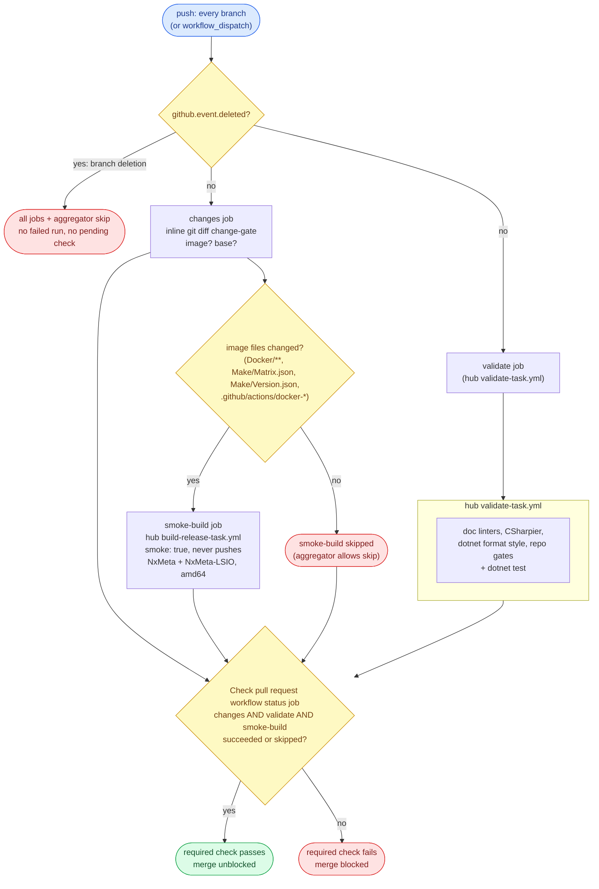
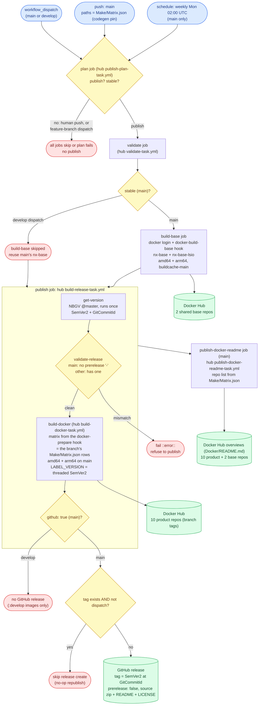
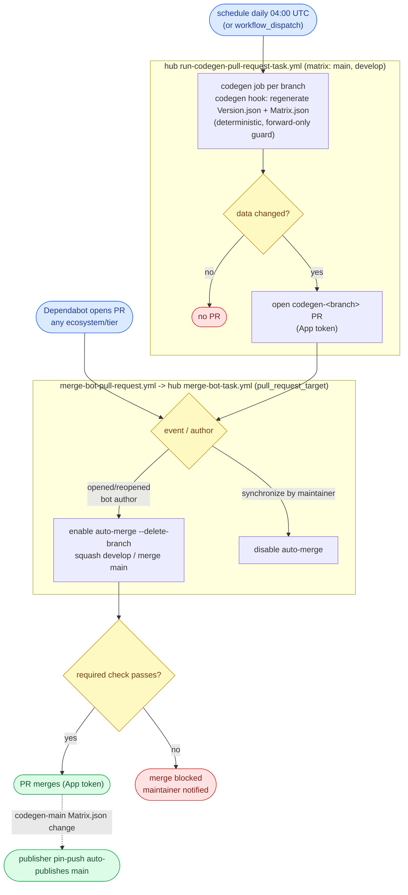
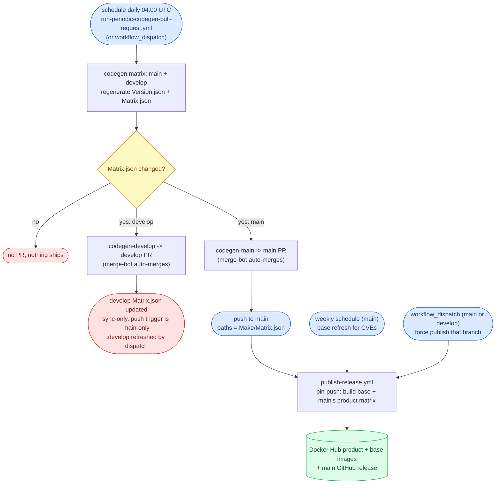

# WORKFLOW.md

The single guide for this repo's CI/CD **workflows** (GitHub Actions): **code style**, **architecture**, a
**behavioral contract** (expected inputs and outputs), and a **test methodology**. Source code style lives
in [`CODESTYLE.md`](./CODESTYLE.md). This file covers everything under
[`.github/workflows/`](./.github/workflows/).

It **describes required outcomes, not a required implementation.** A workflow is correct when it satisfies
the contract (section 4), whatever shape its YAML takes. Section 2 keeps workflows legible. Section 3 is
the model. Section 4 is what they must *do*. Sections 5 and 6 are how to verify it and the configuration it
assumes. Each guarantee names the **failure it prevents**, so the reason survives a reimplementation.

## 0. The model at a glance

NxWitness ships **Docker images only**: a multi-product, multi-base set of multi-arch images on Docker Hub
(five Nx VMS products x {plain, LSIO} = ten product images, plus two shared base images `nx-base` /
`nx-base-lsio`, across 12 Docker Hub repositories). There is **no NuGet publish**: the .NET project
(`CreateMatrix`) is a build-time **matrix generator** only, not a shipped package. Three things do the work:

- **CI** runs on **push to every branch**: it validates (unit tests + lint) and smoke-builds a representative
  image subset, publishing nothing. A pull request merges only when its required check is green.
- **The publisher** is a **triggered-Docker** workflow, one run = one branch. It runs on a **weekly schedule**
  (rebuilds `main` only - full product matrix, shared base refresh for CVEs, versioned release), on a
  **path-scoped push to `main`** when codegen commits a new `Make/Matrix.json` pin (publishes the new product
  versions at once), and on **manual dispatch** (publishes the branch it is started from: `main` ->
  `latest`/`stable`, `develop` -> `:develop`). It never runs on an ordinary merge.
- **Codegen** runs daily, dual-targeting `main` AND `develop`: it regenerates `Make/Version.json` +
  `Make/Matrix.json` from upstream Nx product versions and opens a PR against each base, which the merge-bot
  auto-merges. A merge to `main` whose matrix changed triggers the publisher's path-scoped push.

There is no publish-on-merge for code and no two-branch matrix in the publisher - building only the trigger
branch keeps `github.ref` aligned with the branch being versioned. Dependabot pull requests merge themselves
once their checks pass.

### Glossary

- **Entry workflow** - has `push` / `schedule` / `workflow_dispatch` triggers. The orchestrator that an event
  or a person starts.
- **Reusable workflow (task)** - a `workflow_call` workflow invoked through a `uses:` reference, never
  triggered directly. File ends in `-task.yml`. Every task this repo runs is **hub-hosted** in
  `ptr727/ProjectTemplate` and reached by a SHA-pinned `uses:`, so this repo carries entry workflows only.
- **Hook** - a composite action under [`.github/actions/`](./.github/actions/) that a hub task runs from this
  repo's checkout for the repo-specific step: `docker-prepare` (the image matrix), `docker-build-base` (the
  shared bases), and `codegen` (the generator invocation).
- **Product image** - one shipped image built from a `Make/Matrix.json` row's Dockerfile (e.g. `NxMeta`,
  `NxMeta-LSIO`), pushed to its own Docker Hub repo (`docker.io/ptr727/<image>`).
- **Shared base image** - `nx-base` / `nx-base-lsio`, built once and reused as the `FROM` for the product
  images. Its tag (`:ubuntu-noble`) is **branch-agnostic** (one shared tag, not per-branch).
- **Matrix / version inputs** - `Make/Matrix.json` (the per-product image build rows: name, Dockerfile tags,
  build args, branch) and `Make/Version.json` (the upstream Nx version pins), both regenerated by codegen.
- **Smoke build** - a CI build that compiles a representative image subset (NxMeta + NxMeta-LSIO, amd64) to
  prove the Dockerfiles still build, publishing and pushing nothing. Driven by a `smoke: true` input.
- **Transfer artifact** - a workflow artifact handing data between jobs of one run. The durable copy lives on
  the GitHub release / Docker Hub.
- **Threaded version** - the single NBGV `SemVer2` (plus `GitCommitId`) computed once in the hub's
  `get-version-task.yml`, which `build-release-task.yml` calls, and passed down as `semver2` / `ref` inputs to
  every consumer, never recomputed in a build task.
- **GitHub App token** - a short-lived installation token from `actions/create-github-app-token`, minted from
  the App credentials (`CODEGEN_APP_CLIENT_ID` / `CODEGEN_APP_PRIVATE_KEY`). The merge-bot and the codegen
  PR-opener use it, not `GITHUB_TOKEN`: a `GITHUB_TOKEN` push does not trigger downstream workflows, and that
  token is read-only on Dependabot pull requests.

## 1. Purpose and how to use this document

- **Contract, not implementation.** Conform to the *outcomes* in section 4 and the *architecture* in section
  3. Job names and file layout may vary; the input/output behavior may not.
- **"Operational" - the one definition.** The repo is **operational** when every applicable section-4
  guarantee holds, every applicable section-5B scenario's observed output equals its expected output
  (corroborated by a 5C live probe where a live signal exists), and the section-6 configuration is in place.
  Anything else is **not operational**.
- **Defect vs N/A.** An item is **N/A** only when this repo has no such concern (e.g. a fork-PR scenario,
  since a fork cannot push here, or a NuGet-publish guarantee, since this repo publishes none). A construct
  required by an applicable guarantee but absent is a **defect**.
- **Default branch is `main`.** Guarantees say "default branch" portably. This repo writes the literal `main`
  in the publish guards and the release-version backstop, and the anchored `^refs/heads/main$` in
  `version.json`'s `publicReleaseRefSpec`.

## 2. Workflow style conventions

Legibility rules. Necessary but not sufficient: a perfectly styled workflow can still violate section 4.

- **Action pinning.** Pin every action to a commit SHA with a trailing `# vX.Y.Z` comment. Use `# vX` only
  when the upstream floating major tag has no specific patch SHA. **Sole exception: `dotnet/nbgv@master`** is
  consumed via the floating `@master` ref, never SHA-pinned - its tag stream lags `master` substantially, so
  Dependabot tag-tracking would only propose downgrades to stale tags. That `uses:` lives in the hub's
  `get-version-task.yml`, with its rationale inline. A tool an action *installs* (not a `uses:` ref) is left
  unpinned to track latest.
- **Hub task pinning.** A hub task is reached as
  `ptr727/ProjectTemplate/.github/workflows/<task>.yml@<commit-sha> # <release-tag>`, every call at the same
  hub release, and Dependabot bumps the pin. A hub-side change reaches this repo only through a pin bump.
- **Filename.** Reusable workflows end in `-task.yml`; entry workflows end in what they do
  (`-pull-request.yml`, `-release.yml`). A `-task.yml` is `uses:`-d, never triggered directly, and none is
  carried here.
- **Workflow `name:`.** Reusable names end in **"task"**, entry names in **"action"**.
- **Job and step `name:`.** Every job `name:` ends in **"job"**, every step `name:` in **"step"**, the
  aggregator included (`Check pull request workflow status job`). A job name also bound as a ruleset
  required-check `context:` is codified in the hub's repository-configuration payloads and changed only
  **in lockstep** with the live ruleset.
- **Concurrency.** Every entry workflow declares a `concurrency` group. CI uses
  `group: '${{ github.workflow }}-${{ github.ref }}'`, `cancel-in-progress: true`. The publisher overrides
  it: a ref-independent group with `cancel-in-progress: false`, so two publishes never overlap (a schedule, a
  dispatch, and a `Make/Matrix.json` pin push, or back-to-back dispatches against the shared Docker tags) and
  none is cancelled mid-release. Codegen keys on the workflow only (it writes fixed `codegen-*` branches).
- **Shells.** Every multi-line bash `run:` starts with `set -Eeuo pipefail`.
- **Conditionals.** Multi-line `if:` uses the folded scalar `if: >-`.
- **Boolean inputs.** A boolean used by both `workflow_call` and `workflow_dispatch` is declared in both
  trigger blocks and compared against `true` and `'true'`.
- **Reusable-workflow permissions.** Job-level `permissions:` are validated before `if:`, so even a skipped
  job needs valid permissions. Grant least privilege; a callee's extra scope is granted by the caller.
- **Allowlist `success` and `skipped` explicitly** across an optional dependency: use
  `(needs.X.result == 'success' || needs.X.result == 'skipped')`, not `!= 'failure'`.
- **Line endings.** Workflow YAML is LF, per [`.editorconfig`](./.editorconfig)'s `[*]` default (Actions and Dependabot rewrite it that way). Preserve endings on every edit.

## 3. Architecture

### Three workflows: CI on push, publishing on schedule/pin-push/dispatch, codegen daily

CI ([`test-pull-request.yml`](./.github/workflows/test-pull-request.yml)) and the publisher
([`publish-release.yml`](./.github/workflows/publish-release.yml)) are separate workflows with separate
concurrency, so they never race. CI re-tests every pushed tree and never publishes; the publisher releases on
its own triggers and never runs on an ordinary merge. Codegen
([`run-periodic-codegen-pull-request.yml`](./.github/workflows/run-periodic-codegen-pull-request.yml) -> the
hub's `run-codegen-pull-request-task.yml` -> the [`codegen`](./.github/actions/codegen/action.yml) hook) keeps
the version/matrix data current. *Prevents a merge from silently cutting a release, and a CI run from racing a
publish on the same ref.*

### The publisher builds one branch: the trigger ref

A publish builds exactly **one** branch - the run's trigger ref. The **schedule** and the **pin push** both
run on `main`; a **dispatch** runs on the branch it is started from (`main` or `develop`). The jobs pass
`github.ref_name` as both `ref` and `branch`, so the branch built, versioned, and tagged is always the run's
own ref. *No matrix and no cross-branch ref mixing - `github.ref` is the branch being published.* The hub's
`publish-plan-task.yml` publishes only the long-lived branches (`main` / `develop`); a dispatch from a feature
branch fails the plan job with an `::error::` and publishes nothing. To refresh `:develop`, dispatch the
workflow from `develop`.

Because the run's ref **is** the built branch, the hooks run from that same branch's commit - so a `develop`
dispatch builds develop's own `Make/Matrix.json` rows with develop's hooks, and the schedule runs main's. The
hub tasks themselves resolve at the pinned hub commit on every branch.

### The publisher's pin-push trigger

The publisher's `push` trigger is branch-filtered to `main` and path-filtered to `Make/Matrix.json`. So an
ordinary code merge never publishes; only a change to the codegen matrix pin (committed to `main` by the
auto-merged `codegen-main` PR) does, shipping the new upstream Nx product versions immediately. develop's
daily codegen pin update is sync-only - the push trigger is main-only - and never publishes; `:develop` is
refreshed by manual dispatch. The weekly schedule still runs with no matrix change, to refresh the shared
base image for CVEs.

### The multi-image build layer

The publisher is a `plan` -> `validate` -> `build-base` -> `publish` -> `publish-docker-readme` chain (a
multi-product Docker repo, the matrix and `build-base` case of the hub's Docker family). The `build-base` job
logs in to Docker Hub and runs the [`docker-build-base`](./.github/actions/docker-build-base/action.yml) hook
to build and push the two shared bases. It is this repo's own job rather than the hub's `build-base` leg,
since that leg carries no Docker Hub login and a composite hook cannot read secrets. The `publish` job calls
the hub's `build-release-task.yml`, whose Docker leg (the hub's `build-docker-task.yml`) takes the product
matrix from the [`docker-prepare`](./.github/actions/docker-prepare/action.yml) hook, which maps the
branch's `Make/Matrix.json` rows onto the hub's matrix shape. The shared base is built **once** (on the
`main` run) and reused: a `develop` dispatch skips `build-base` and pulls main's published base, so it never
overwrites the branch-agnostic `nx-base` tag. The hub core owns the cache policy: the product build reads both
branches' registry buildcaches (`buildcache-main`, `buildcache-develop`) and writes only its own branch's
cache, only when pushing.

### Versioning: compute once, thread everywhere

NBGV runs once (in the hub's `get-version-task.yml`, called by `build-release-task.yml`), classifying from
`github.ref`, and its outputs (`SemVer2`, `GitCommitId`) thread to every consumer via `outputs:` / `needs:` /
`semver2` inputs. The hub's `build-docker-task.yml` accepts the threaded `semver2` as the image
`LABEL_VERSION` and never re-runs NBGV - one classification feeds every product leg, so no second NBGV run can reclassify or collide a
tag. A build job may check out a specific commit to compile it (main pins to `GitCommitId`) but consumes the
threaded version. `main` (the public ref, `publicReleaseRefSpec = ^refs/heads/main$`) builds a clean
`X.Y.<height>`; every other branch a prerelease `X.Y.<height>-g<sha>`. *Keeps each image's embedded version
and the release tag in agreement.*

NBGV classifies `publicReleaseRefSpec` from the `GITHUB_REF` environment variable. Because the publisher
builds the **trigger ref** (one branch per run), `GITHUB_REF` already equals the branch being versioned - a
schedule, a pin push, or a `main` dispatch classifies as public; a `develop` dispatch as prerelease - so no
`GITHUB_REF` override is needed (`IGNORE_GITHUB_REF` is only for matrix publishers that build a non-trigger
branch). The main-version backstop (D2.2) catches any misclassification.

NBGV's version is the GitHub release tag on `main` and the `LABEL_VERSION` build arg baked into the images.
The Docker image **tags** themselves carry the Nx product version from `Make/Matrix.json`, distinct from the
NBGV build version.

### Validate at entry

A run that carries a cross-input invariant (`main` must not carry a prerelease suffix, and any other branch
must carry one) asserts it once with `::error::` before anything builds. The hub's `build-release-task.yml`
runs that check in its `validate-release` job, which every build job `needs:`.

### Fast CI feedback, head-resolved

CI runs on push to every branch, and the hooks resolve from the pushed head, so a pull request that edits a
hook tests its own copy. The hub tasks resolve at their pinned commit, so a hub-side change is tested by the
pull request that bumps the pin. CI validates (the hub's `validate-task.yml`: the document linters, CSharpier
and `dotnet format style`, the repo gates, and `dotnet test`) on every push, and smoke-builds a
representative image subset only when image files or the Docker hooks changed (an inline `git diff`
change-gate, no `dorny/paths-filter`), through the hub's `build-release-task.yml` with `smoke: true`,
uploading and pushing nothing. One
aggregator job, the ruleset-bound required check, gates the merge. A branch-deletion push (all-zeros
`github.sha`) is skipped by a `!github.event.deleted` guard on every job, so a deletion never runs a failing
build.

### The Docker-only release

The hub's `github-release` job tags the built commit and creates the GitHub release (auto source zip +
README + LICENSE; `target_commitish` pinned to `GitCommitId`; skip-existing guard). The caller sets
`github: true` only on `main`, so a `develop` dispatch cuts no release. This repo ships **no**
`release-asset-*` binaries or packages - the published artifacts are the Docker Hub images - so it sets
`expect_release_assets: false`, which skips the release-asset download and relaxes
`fail_on_unmatched_files`. The GitHub release exists only as the version anchor / tag. The Docker Hub
repository overview ([`Docker/README.md`](./Docker/README.md), the hub default's first choice) is pushed to
every product + base repo on a `main` publish by the hub's `publish-docker-readme-task.yml`, since Docker
Hub does not read the GitHub README; the repo list is derived from `Make/Matrix.json` by the task's
`manifest-jq` input.

### Resource lifecycle

Workflow artifacts are an intra-run handoff; the durable copy lives on the GitHub release / Docker Hub. This
repo uploads none: the images go straight to Docker Hub and the release carries no `release-asset-*` files.
The hub's `github-release` job still owns the consume-then-delete cleanup, `continue-on-error` so
housekeeping never reds the run, should a target that uploads one ever be enabled.

### Self-sufficiency: automatic updates

Every Dependabot pull request, any ecosystem and any tier, auto-merges once the required checks pass, a
semver-major NuGet bump included, since the required checks are the gate (D8.2). The merge-bot is the hub's
`merge-bot-task.yml`. Codegen opens a `codegen-main` -> `main` and a
`codegen-develop` -> `develop` PR daily; the merge-bot auto-merges each independently (`--delete-branch`).
A merged dependency bump does not itself publish; a merged matrix pin on `main` does (the pin-push trigger).
A person steps in only for a breaking change (a red check) or to dispatch a release.

### Flow diagrams

Four diagrams trace the architecture above: the pull-request gate, the self-publisher, the bot
automation, and the trigger chain that turns a daily codegen run into a published release. They depict
the same outcomes that the section 4 contract specifies, drawn from the workflow YAML; if a diagram and
a guarantee disagree, one of them is a defect. Triggers are blue, gates yellow, durable/published
outputs green, and stop/skip outcomes red.

**Pull request (CI) - `test-pull-request.yml`.** Every push runs the hub's validate gate, smoke-builds a representative image subset only when image files changed, and a single
aggregator produces the ruleset-bound required check (D1, D6).

```mermaid
flowchart TD
    T(["push: every branch<br/>(or workflow_dispatch)"]):::trig
    T --> D{"github.event.deleted?"}:::gate
    D -- "yes: branch deletion" --> X(["all jobs + aggregator skip<br/>no failed run, no pending check"]):::stop
    D -- "no" --> CH["changes job<br/>inline git diff change-gate<br/>image? base?"]
    D -- "no" --> V["validate job<br/>(hub validate-task.yml)"]
    subgraph VT ["hub validate-task.yml"]
        VU["doc linters, CSharpier,<br/>dotnet format style, repo gates<br/>+ dotnet test"]
    end
    V --> VT
    CH --> SG{"image files changed?<br/>(Docker/**, Make/Matrix.json, Make/Version.json,<br/>.github/actions/docker-*)"}:::gate
    SG -- "no" --> SS(["smoke-build skipped<br/>(aggregator allows skip)"]):::stop
    SG -- "yes" --> S["smoke-build job<br/>hub build-release-task.yml<br/>smoke: true, never pushes<br/>NxMeta + NxMeta-LSIO, amd64"]
    CH --> A
    VT --> A
    S --> A
    SS --> A
    A{"Check pull request workflow status job<br/>changes AND validate AND smoke-build<br/>succeeded or skipped?"}:::gate
    A -- "yes" --> G(["required check passes<br/>merge unblocked"]):::pub
    A -- "no" --> R(["required check fails<br/>merge blocked"]):::stop
    classDef trig fill:#dbeafe,stroke:#2563eb,color:#1e3a8a
    classDef gate fill:#fef9c3,stroke:#ca8a04,color:#713f12
    classDef pub fill:#dcfce7,stroke:#16a34a,color:#14532d
    classDef stop fill:#fee2e2,stroke:#dc2626,color:#7f1d1d
```

**Publish - `publish-release.yml`.** A weekly schedule (main), a `Make/Matrix.json` pin push (main), or a
dispatch plans, validates, builds the shared base (main only), then calls the hub release chain, which
versions once with NBGV, builds the branch's product matrix with the threaded SemVer2, and cuts the main-only
GitHub release; the Docker Hub overviews refresh last (D0, D2, D3, D4).

```mermaid
flowchart TD
    P1(["schedule: weekly Mon 02:00 UTC<br/>(main only)"]):::trig --> PL
    P2(["push: main<br/>paths = Make/Matrix.json (codegen pin)"]):::trig --> PL
    P3(["workflow_dispatch<br/>(main or develop)"]):::trig --> PL
    PL{"plan job (hub publish-plan-task.yml)<br/>publish? stable?"}:::gate
    PL -- "no: human push, or<br/>feature-branch dispatch" --> PLS(["all jobs skip or plan fails<br/>no publish"]):::stop
    PL -- "publish" --> VAL["validate job<br/>(hub validate-task.yml)"]
    VAL --> BB{"stable (main)?"}:::gate
    BB -- "develop dispatch" --> BBS(["build-base skipped<br/>reuse main's nx-base"]):::stop
    BB -- "main" --> BBJ["build-base job<br/>docker login + docker-build-base hook<br/>nx-base + nx-base-lsio<br/>amd64 + arm64, buildcache-main"]
    BBJ --> PUB
    BBS --> PUB
    subgraph PUB ["publish job: hub build-release-task.yml"]
        GVR["get-version<br/>NBGV @master, runs once<br/>SemVer2 + GitCommitId"] --> VR{"validate-release<br/>main: no prerelease '-'<br/>other: has one"}:::gate
        VR -- "clean" --> BD["build-docker (hub build-docker-task.yml)<br/>matrix from the docker-prepare hook<br/>= the branch's Make/Matrix.json rows<br/>amd64 + arm64 on main<br/>LABEL_VERSION = threaded SemVer2"]
        BD --> RG{"github: true (main)?"}:::gate
    end
    VR -- "mismatch" --> VRX(["fail ::error::<br/>refuse to publish"]):::stop
    BD --> DH[("Docker Hub<br/>10 product repos (branch tags)")]:::pub
    BBJ --> DHB[("Docker Hub<br/>2 shared base repos")]:::pub
    RG -- "develop" --> RGS(["no GitHub release<br/>(:develop images only)"]):::stop
    RG -- "main" --> EX{"tag exists AND not dispatch?"}:::gate
    EX -- "yes" --> EXS(["skip release create<br/>(no-op republish)"]):::stop
    EX -- "no" --> REL[("GitHub release<br/>tag = SemVer2 at GitCommitId<br/>prerelease: false, source zip + README + LICENSE")]:::pub
    PUB --> DRM["publish-docker-readme job (main)<br/>hub publish-docker-readme-task.yml<br/>repo list from Make/Matrix.json"]
    DRM --> DRO[("Docker Hub overviews (Docker/README.md)<br/>10 product + 2 base repos")]:::pub
    classDef trig fill:#dbeafe,stroke:#2563eb,color:#1e3a8a
    classDef gate fill:#fef9c3,stroke:#ca8a04,color:#713f12
    classDef pub fill:#dcfce7,stroke:#16a34a,color:#14532d
    classDef stop fill:#fee2e2,stroke:#dc2626,color:#7f1d1d
```

**Automation - codegen + Dependabot + merge-bot.** Daily codegen and Dependabot open in-repo bot PRs; the
merge-bot enables auto-merge (or disables it on a maintainer push); the required check gates each merge
(D8).

```mermaid
flowchart TD
    SCH(["schedule daily 04:00 UTC<br/>(or workflow_dispatch)"]):::trig --> CG
    subgraph CGT ["hub run-codegen-pull-request-task.yml (matrix: main, develop)"]
        CG["codegen job per branch<br/>codegen hook: regenerate Version.json + Matrix.json<br/>(deterministic, forward-only guard)"] --> CGC{"data changed?"}:::gate
        CGC -- "no" --> CGN(["no PR"]):::stop
        CGC -- "yes" --> CPR["open codegen-&lt;branch&gt; PR<br/>(App token)"]
    end
    DEP(["Dependabot opens PR<br/>any ecosystem/tier"]):::trig --> MB
    CPR --> MB
    subgraph MBT ["merge-bot-pull-request.yml -> hub merge-bot-task.yml (pull_request_target)"]
        MB{"event / author"}:::gate
        MB -- "opened/reopened<br/>bot author" --> EN["enable auto-merge --delete-branch<br/>squash develop / merge main"]
        MB -- "synchronize by maintainer" --> DIS["disable auto-merge"]
    end
    EN --> CK{"required check passes?"}:::gate
    CK -- "yes" --> MRG(["PR merges (App token)"]):::pub
    CK -- "no" --> BLK(["merge blocked<br/>maintainer notified"]):::stop
    MRG -. "codegen-main Matrix.json change" .-> PUBR(["publisher pin-push auto-publishes main"]):::pub
    classDef trig fill:#dbeafe,stroke:#2563eb,color:#1e3a8a
    classDef gate fill:#fef9c3,stroke:#ca8a04,color:#713f12
    classDef pub fill:#dcfce7,stroke:#16a34a,color:#14532d
    classDef stop fill:#fee2e2,stroke:#dc2626,color:#7f1d1d
```

**Trigger chain - daily codegen to published release.** The recurring path that ships a new upstream Nx
product version with no human in the loop: only a `codegen-main` matrix change reaches the publisher's
pin push; the develop pin update is sync-only, and `:develop` / the weekly base refresh come from the
schedule and dispatch (D4.1, D8.3).

```mermaid
flowchart TD
    PER(["schedule daily 04:00 UTC<br/>run-periodic-codegen-pull-request.yml<br/>(or workflow_dispatch)"]):::trig --> CGM
    CGM["codegen matrix: main + develop<br/>regenerate Version.json + Matrix.json"] --> DCH{"Matrix.json changed?"}:::gate
    DCH -- "no" --> NOPR(["no PR, nothing ships"]):::stop
    DCH -- "yes: main" --> PRM["codegen-main -> main PR<br/>(merge-bot auto-merges)"]
    DCH -- "yes: develop" --> PRD["codegen-develop -> develop PR<br/>(merge-bot auto-merges)"]
    PRD --> SYNC(["develop Matrix.json updated<br/>sync-only, push trigger is main-only<br/>:develop refreshed by dispatch"]):::stop
    PRM --> PUSH(["push to main<br/>paths = Make/Matrix.json"]):::trig
    PUSH --> PUB["publish-release.yml<br/>pin-push: build base + main's product matrix"]
    PUB --> SINK[("Docker Hub product + base images<br/>+ main GitHub release")]:::pub
    SCHED(["weekly schedule (main)<br/>base refresh for CVEs"]):::trig --> PUB
    DISP(["workflow_dispatch (main or develop)<br/>force publish that branch"]):::trig --> PUB
    classDef trig fill:#dbeafe,stroke:#2563eb,color:#1e3a8a
    classDef gate fill:#fef9c3,stroke:#ca8a04,color:#713f12
    classDef pub fill:#dcfce7,stroke:#16a34a,color:#14532d
    classDef stop fill:#fee2e2,stroke:#dc2626,color:#7f1d1d
```

## 4. Behavioral contract - expected outcomes

Each is a **MUST**, stated as input -> output plus the failure it prevents.

### D0 - Architecture

- **D0.1 CI is one run, one branch.** Input: any push. Output: `test-pull-request` builds/validates exactly
  `github.ref_name` and publishes nothing. *Prevents cross-branch ref mixing in CI.*
- **D0.2 The publisher builds one branch: the trigger ref.** Output: the publisher passes `github.ref_name`
  as `ref` and `branch`, so it checks out, versions, and tags exactly the run's own branch (the schedule/pin
  push's `main`, or a dispatch's branch). No branch matrix; the hub's `publish-plan-task.yml` publishes only
  `main`/`develop`.
  *Prevents cross-branch ref mixing - `github.ref` is the branch being published.*
- **D0.3 One version, threaded.** Output: NBGV runs once (the hub's `get-version-task.yml`, inside
  `build-release-task.yml`); every consumer reads it via
  `needs:` outputs / the `semver2` input; no consumer recomputes it. *Allowed:* checking out a specific
  commit to compile it, and recording the built commit as the release `target_commitish`. *Prevents an
  image's embedded version diverging from its tag, and a second NBGV run colliding image tags.*

### D1 - CI fast feedback

- **D1.1 Every push validates; image changes smoke-build.** Output: on any push the `validate` job (the
  hub's `validate-task.yml`) runs with no paths filter; `smoke-build` (NxMeta + NxMeta-LSIO, amd64, no push)
  runs when the inline change-gate detects an image-file change (`Docker/**`, `Make/Matrix.json`,
  `Make/Version.json`, `.github/actions/docker-*`). *Prevents a hook or Dockerfile break shipping untested.*
- **D1.2 Unit tests always run.** Output: the hub's `validate-task.yml` runs `dotnet test` (the codegen tool +
  its tests).
- **D1.3 Lint enforces the editor checks in CI.** Output: the hub's `validate-task.yml` runs `dotnet
  csharpier check` and `dotnet format style --verify-no-changes` - the same checks the editor and the Husky
  pre-commit hook run - plus the document linters, `actionlint`, the composite-action schema check,
  `shellcheck`, `editorconfig-checker`, and the hub's repo gates.
- **D1.4 Smoke never publishes and never uploads a release asset.** Output: a smoke build compiles the image
  subset but makes no GitHub release and no Docker push (`smoke: true`, which disables every push in the hub's
  `build-release-task.yml`, and `github: false`). The Docker login runs
  on every build including smoke (for higher pull/cache rate limits against the registry buildcache), so a
  Dependabot-triggered push-CI smoke build needs the Docker Hub credentials in both secret stores; fork PRs do
  not run this push-CI.
- **D1.5 One required aggregator gates merge.** Output: a single aggregator job must **succeed** (success or,
  for the conditionally-skipped `smoke-build`, skipped; never failure/cancelled), `needs:` `changes`,
  `validate`, and `smoke-build`, and treats a `changes` failure as blocking (so an image-changing PR cannot
  merge on a `changes` failure mis-read as skip). Its name is ruleset-bound (D6.2) and must not be renamed.

### D2 - Validation at entry

- **D2.1 Validate the cross-input invariant before publishing.** Output: the hub's `validate-release` job
  asserts each cross-input invariant with `::error::` (the version backstop, D2.2) before anything builds;
  every build job `needs:` it. The publish run also re-runs the hub's `validate-task.yml` (the `validate` job
  gates `build-base` and `publish`), so a publish can never ship a tree that would fail the same lint + `dotnet test` gate
  CI enforces on push - on the trigger branch CI already validated, re-checked at publish time.
- **D2.2 Main matches version classification.** Input: a real publish run. Output: the run fails loudly if
  `main` carries a prerelease suffix, or if any other branch carries none. It strips `+buildmetadata` before testing for the
  prerelease `-`. *Prevents a develop build published as the stable `latest`.*

### D3 - Versioning and classification

- **D3.1 NBGV runs once, threaded.** Output: NBGV runs once, classifying from the checked-out branch; no
  consumer re-invokes it. The run builds the trigger ref, so `GITHUB_REF` already matches the branch being
  versioned and NBGV classifies it correctly (no `IGNORE_GITHUB_REF`). The threaded `semver2` is the image
  `LABEL_VERSION`.
- **D3.2 `main` = stable, others = prerelease.** Output: `main` -> `X.Y.Z`, any other branch ->
  `X.Y.Z-g<sha>`. The release-version backstop names `main`; `publicReleaseRefSpec` is `^refs/heads/main$`.
- **D3.3 Version floor + git height.** Output: `version.json` sets the major.minor floor, NBGV appends the git
  height as the patch, never bumped on a cadence. *(Who raises the floor and when is a human-process rule in
  [`GOVERNANCE.md` "Release Model"](./GOVERNANCE.md#release-model).)*

### D4 - Release / publish

- **D4.1 Publish only on schedule, the matrix-pin push, or dispatch - never on an ordinary merge.** Output:
  `publish-release` triggers are `schedule` (weekly), `workflow_dispatch`, and a `push` **branch-filtered to
  `main` and path-filtered to `Make/Matrix.json`**. There is no other `push` trigger and no `PUBLISH_ON_MERGE`
  variable. The hub's `publish-plan-task.yml` publishes only `main` and `develop`, and fails a dispatch from a
  feature branch with an `::error::`, publishing nothing. *Prevents per-merge release churn while still shipping a new product pin at once.*
- **D4.2 A publish builds the one trigger branch in full.** Output: the run builds the shared base (main run
  only) + the full product matrix and creates the GitHub release for `github.ref_name` - the schedule/pin push
  rebuilds `main` (stable / `latest`); a dispatch publishes its own branch (`main` stable / `latest`,
  `develop` prerelease / `:develop`, no GitHub release). *Prevents a half-published image set and cross-branch
  ref mixing.*
- **D4.3 Tag the built commit.** Output: the release `target_commitish` is the run's `GitCommitId` (the tip of
  `main`), and main's images are built from that pinned commit, never the moving ref. *Prevents the tag /
  embedded version landing on the wrong commit.*
- **D4.4 Release contents and gate.** Output: a release is a tag on the built commit plus the auto source zip,
  README, and LICENSE - no binary release assets (`expect_release_assets: false`; the images are the
  artifact). The release is `main`-only (`github: true` only when the plan says stable); `prerelease: false`. *Prevents
  publishing a develop build as a stable GitHub release.*
- **D4.5 No-op republish.** Input: a weekly re-run whose version is unchanged. Output: the release-create step
  is skipped when the tag already exists (refreshed only on `workflow_dispatch`), while the Docker push still
  runs - re-pushing the same tags refreshes the shared base image. *Prevents duplicate releases while still
  refreshing the images.*
- **D4.6 Publish is built from the tree CI validated.** Output: the run's ref **is** the published branch, so
  the hooks and the built tree resolve from that branch - the same tree CI validated on push (the required
  check gates every merge to it) - and the hub tasks resolve at the same pinned commit CI used. The publish
  run re-runs the hub's `validate-task.yml` (the `validate` job gates `build-base` and `publish`). The version
  backstop (D2.2) is the additional in-publisher gate.
- **D4.7 Docker publishing authenticates with Docker Hub credentials.** Output: the publisher's `build-base`
  job and the hub's product build each log in via `docker/login-action` with `DOCKER_HUB_USERNAME` +
  `DOCKER_HUB_ACCESS_TOKEN` and push with `docker/build-push-action`; the hub's readme task pushes the Docker
  Hub overview with the same token, mapped by name to each hub task. There is **no NuGet/OIDC
  publishing** in this repo. *Prevents a missing-credential publish failure.*
- **D4.8 Branch-scoped Docker buildcache.** Output: the product build reads both branches' registry caches
  (`buildcache-main`, `buildcache-develop`) and writes only its own branch's cache, only when pushing, so a
  `main` and a `develop` publish never overwrite each other's cache. The shared base, pushed only by a `main`
  publish, reads and writes `buildcache-main` alone. *Prevents one branch's publish
  destroying the other's cache hit-rate.*
- **D4.9 Multi-arch, multi-product, shared-base fan-out.** Output: the publish builds every product image from
  `Make/Matrix.json` for `linux/amd64` + `linux/arm64`, on the shared base built once and reused; each product
  image pushes to its own Docker Hub repo. *Prevents a per-arch or per-product gap, and a redundant per-branch
  base rebuild overwriting the shared tag.*

### D5 - Resource cleanup

- **D5.1 No dangling transfer artifacts.** Output: neither the publisher nor CI uploads a transfer
  artifact - the images push straight to Docker Hub and the release carries no `release-asset-*` files - so a
  run leaves none behind. The hub's `github-release` job owns the consume-then-delete cleanup
  (`continue-on-error`) for a target that does upload one.
- **D5.2 Never red the run on cleanup.** Cleanup failures warn, never fail.

### D6 - Self-testing workflows

- **D6.1 A change is testable on its own branch.** Output: a workflow or build change is exercised by CI on
  the branch that introduces it, no dependency on reaching `main` first.
- **D6.2 Head-resolution, single producer, fork exception.** Output: CI runs on `push` to every branch so
  the `./.github/actions/` hooks resolve from the head (the hub tasks resolve at their pin), and the aggregator's ruleset-bound `context:` is produced by
  that push run as the sole producer of that name. Dependabot and codegen PRs are in-repo branches, validated
  the same way. A fork cannot push, so it has no run and is validated by maintainer action - the one
  exception. *Prevents a dual-producer context race and a false self-test claim for forks.*

### D7 - Concurrency, permissions, safety

- **D7.1 The publisher does not cancel mid-flight.** Output: ref-independent group, `cancel-in-progress:
  false`. CI uses the `...-${{ github.ref }}` group with `cancel-in-progress: true`; the merge-bot keys on PR
  number (D8.1); codegen keys on the workflow.
- **D7.2 Skipped jobs still need valid permissions.** Output: every reusable job runs under valid least-privilege
  `permissions:`; a callee's extra scope is granted by the caller.
- **D7.3 Boolean inputs both forms.** Declared in both trigger blocks, compared against `true` and `'true'`.
- **D7.4 Branch-deletion guard.** Output: every CI job carries `if: !github.event.deleted` and the aggregator
  `always() && !github.event.deleted`, so a branch-deletion push (all-zeros `github.sha`) runs no failing
  build and does not fail the required check.

### D8 - Bots and automation

- **D8.1 Merge-bot.** Output: a thin caller onto the hub's `merge-bot-task.yml`, run on
  `pull_request_target`, holding the App token, merging the PR by URL without checking out its code. Enables
  auto-merge on `opened`/`reopened` with `--delete-branch` (the `delete-branch: true` input); squash on
  `develop`, merge-commit on `main` by the PR's base ref; disables auto-merge when a maintainer pushes to a
  bot branch (no `--delete-branch` on the disable path). Concurrency keyed on PR number.
- **D8.2 Dependabot auto-merges on green.** Output: every Dependabot PR, any ecosystem and any tier,
  auto-merges once the required checks pass. A failing check blocks the merge. A merged dependency bump does **not** itself publish (it ships in the next scheduled run
  or the next matrix-pin push).
- **D8.3 Codegen dual-targets `main` AND `develop`.** Output: the daily codegen matrix (the hub's
  `run-codegen-pull-request-task.yml`, running the `codegen` hook) opens a
  `codegen-main` -> `main` and a `codegen-develop` -> `develop` PR (strict head/base pairing in the merge-bot),
  regenerating `Make/Version.json` + `Make/Matrix.json` **only** (not the Dockerfiles - those are a separate
  human-driven `Make/Create.sh` path). The merge-bot auto-merges each independently. develop's matrix update
  is sync-only; a merged `codegen-main` matrix change fires the publisher's pin push. *Prevents non-linear
  rebase/merge-block conflicts (the rejected single-target scheme) and keeps both branches current with
  upstream Nx versions.*
- **D8.4 Forward-only version guard.** Output: the codegen tool's forward-only guard (`ReleaseVersionForward`,
  covered by `CreateMatrixTests`) prevents a regenerated matrix from regressing a product version. *Prevents a
  generic-tag downgrade slipping in via codegen.*

### D9 - Style, static, and dropped workflows (see section 2)

- **D9.1** Every action SHA-pinned with a version comment (sole exception: `dotnet/nbgv@master`, whose tag
  stream lags master so Dependabot tag-tracking would only propose downgrades to stale tags - a deliberate
  documented float, rationale inline in the hub's `get-version-task.yml`); an installed-tool version is left unpinned to
  track latest.
- **D9.2** File/workflow/job/step names follow the suffix rules; a ruleset-bound `context:` name moves only in
  lockstep with the live ruleset and the hub payload it is applied from.
- **D9.3** Bash `run:` blocks start `set -Eeuo pipefail`; multi-line `if:` uses `>-`.
- **D9.4** Line endings follow `.editorconfig`.
- **D9.5 No decorative / dropped workflows.** No date-badge (`build-datebadge-*`), no carried `-task.yml`
  (every task is hub-hosted), no `PUBLISH_ON_MERGE` variable, no `dorny/paths-filter` (replaced by the
  inline change-gate). Their presence is a defect to remove.
- **D9.6** Style is enforced in CI by the hub's `validate-task.yml` (D1.3), from the same config files the
  editor and Husky hook use.

### D10 - Repository configuration

- **D10.1 Required configuration is present.** Output: the secrets, branch rulesets, and repository settings
  section 6 lists are all in place, codified in the hub's repository-configuration payloads and audited by the
  hub's `configure.sh check` (the 5D audit). The detail is in section 6.

## 5. Test methodology

### 5A. Static audit (no execution)

Read the workflow files plus `version.json` and `Make/Matrix.json` and assert the fact behind each applicable
guarantee with a `file:line` citation:

- **D0:** CI has no branch matrix; the publisher passes `github.ref_name` as `branch` and `github.sha` as
  `ref`, and the plan task publishes only `main`/`develop`; NBGV invoked once in the hub's
  `build-release-task.yml`, whose Docker leg consumes the threaded `semver2`; the run builds the trigger ref so `GITHUB_REF` matches the versioned
  branch.
- **D1:** CI runs on `push` with no paths filter on `validate`; the inline `changes` gate sets `image`/`base`;
  `smoke-build` is `smoke: true`, `github: false`, `dockerhub: false`, the NxMeta subset named by
  `docker_image`; the aggregator `needs:` `changes` +
  `validate` + `smoke-build`, blocks on non-success, treats `changes` failure as blocking.
- **D2:** the hub's `validate-release` checks the prerelease `-`, strips `+buildmetadata`; the hub's
  `validate-task.yml` is the shared gate.
- **D3:** `main` appears in the backstop and the release `prerelease: false`/guard; `publicReleaseRefSpec` is
  `^refs/heads/main$`; `semver2` threads to `LABEL_VERSION`.
- **D4:** `publish-release` triggers are `schedule` + `workflow_dispatch` + `push` (branches `[main]`, paths
  `[Make/Matrix.json]`) only (no other push, no `PUBLISH_ON_MERGE`); every job gates on the plan outputs;
  `ref` is `github.sha`, which the hub versions and tags as `GitCommitId`; `build-base` runs only when stable
  and develop reuses the base (`docker_build_base: false`); the builds log in with `DOCKER_HUB_*`; buildcache
  branch-scoped and write-gated on push; release-create gated `exists == false || workflow_dispatch`;
  `github` and `publish-docker-readme` gated to stable; the `docker-prepare` hook emits the branch's
  `Make/Matrix.json` rows, built amd64+arm64 on `main`.
- **D5:** no job uploads a transfer artifact; `expect_release_assets: false`.
- **D6:** CI is `push` on every branch; the hooks resolve from the checkout; the aggregator context has exactly one producer; no `pull_request`
  trigger; every CI job has the `!github.event.deleted` guard.
- **D7:** the publisher group is ref-independent with `cancel-in-progress: false`; the merge-bot keys on PR
  number; codegen keys on the workflow; CI uses the standard group + deletion guard; every entry workflow
  declares `permissions: {}` and each calling job grants its task's scope.
- **D8/D9:** the merge-bot calls the hub's `merge-bot-task.yml` on `pull_request_target`, keyed on PR number,
  with `delete-branch: true`; Dependabot auto-merges every tier; codegen dual-targets main+develop and its
  hook regenerates only `Version.json`/`Matrix.json`; no date-badge, carried `-task.yml`,
  `PUBLISH_ON_MERGE`, or `dorny/paths-filter`; actions and hub tasks SHA-pinned except `nbgv@master`;
  names/shells/conditionals per section 2.

### 5B. End-to-end trace scenarios (deterministic from the YAML)

| # | Input | Expected output | Exercises |
| --- | --- | --- | --- |
| S1 | push touching `Docker/**` | `validate` + `smoke-build` (NxMeta amd64) run, **no push, no release**; aggregator success; no dangling artifacts | D0.1, D1 |
| S2 | push changing only docs | `validate` runs; the `changes` gate sets `image=false`; `smoke-build` skipped; aggregator success (skip allowed) | D1, D1.5 |
| S3 | push changing only `.github/workflows/**` | `validate` runs; `smoke-build` skipped (no image files); aggregator success | D1.1, D6.1 |
| S4 | weekly `schedule` | builds + publishes `main` only: shared base refresh + full product matrix (amd64+arm64) + stable release + `latest`; `target_commitish` = main's SHA; develop untouched; no dangling artifacts | D4.1, D4.2, D4.9 |
| S5 | push to `main` changing `Make/Matrix.json` (codegen pin) | publishes `main` with the new product versions immediately | D4.1, D8.3 |
| S6 | `workflow_dispatch` from `develop` | builds + publishes `develop`: `:develop` images, prerelease classification, `build-base` skipped (reuses main's base), **no GitHub release** | D4.1, D4.2, D3.2 |
| S7 | `workflow_dispatch` re-run on `main`, no new commits | release-create refreshed on dispatch (skipped on schedule if the tag exists); Docker re-pushed (base refresh); no duplicate release | D4.5 |
| S8 | `workflow_dispatch` from a feature branch | the plan job fails with an `::error::` and every later job skips -> no publish | D4.1 |
| S9 | merged dependency bump (any) | not a matrix-pin change; merges don't publish -> **no release**; ships in the next scheduled run | D4.1, D8.2 |
| S10 | merged develop codegen PR (`Matrix.json` change on develop) | sync-only; the pin push is main-only -> **no publish** | D8.3 |
| S11 | PR with a CSharpier / format / unit-test failure | `validate` fails -> aggregator blocks the merge | D1.2, D1.3, D1.5 |
| S12 | `version.json` floor bump merged | merges don't publish -> no immediate release; the new floor ships in the next publish | D3.3, D4.1 |
| S13 | Dependabot semver-major NuGet bump | auto-merges on green like every other tier; a red check blocks it | D8.2 |
| S14 | branch-deletion push | every CI job + the aggregator skip (`!github.event.deleted`) -> no failing required check | D7.4 |
| S15 | `develop` -> `main` promotion (merge commit) | the merge itself does not publish; if it changed `Matrix.json` the pin push publishes main, else the next schedule does | D4.1, D8.1 |

### 5C. Live probe (where warranted, never publishing)

- Open a trivial doc-only PR and confirm S2 (`validate` runs, `smoke-build` skipped, aggregator green, 0
  artifacts left); open an image-touching PR and confirm S1 (smoke-build runs amd64, nothing pushed).
- After a `main` publish (schedule, pin push, or dispatch) confirm a stable release (`isPrerelease == false`)
  with multi-arch product images (`docker buildx imagetools inspect` shows amd64 + arm64) and the shared base
  tags intact; after a `develop` dispatch confirm `:develop` images, prerelease classification, and that the
  shared `nx-base:ubuntu-noble` tag was not overwritten. A re-run adds no duplicate release. Absent publish
  rights, record indeterminate and rely on 5A/5B.
- Trigger codegen via dispatch: confirm both `codegen-main` -> `main` and `codegen-develop` -> `develop` PRs
  open and the merge-bot auto-merges with branch deletion.

### 5D. Configuration audit

Run the hub's `repo-config/configure.sh check <owner>/<repo> release` from a hub checkout at `main`. It
confirms the listed secrets exist (in both
stores), the `main`/`develop` rulesets enforce the required merge method + status check + signed commits +
strict-off, and the repository settings are in place, exiting non-zero on drift. Secret *values* cannot be
read back, so it asserts the names exist (failing if it cannot query them). The GitHub App installation is a
best-effort check (a precise check needs app-level auth, so it notes rather than fails). The Docker Hub
token's validity and push scope across the 12 repositories are a manual checklist item.

### Assessment

Operational when every applicable 5A item passes, every applicable 5B scenario matches (corroborated by 5C
where a live signal exists), and 5D configuration is in place. Procedure: **Audit** (5A + 5D) -> **Trace**
(5B) -> **Probe** (5C, without publishing) -> **Verdict** with the failing guarantee(s) and the triggering
input for each.

## 6. Repository configuration

The workflows depend on configuration outside the YAML. A misconfiguration surfaces only as a failed run, so
the configuration is part of "operational" (D10; audit 5D).

**Secrets.**

- `DOCKER_HUB_USERNAME` / `DOCKER_HUB_ACCESS_TOKEN` - Docker Hub credentials the base and product builds log
  in with to push the images and the repository overviews. Required in **both** the Actions and Dependabot
  secret stores: a Dependabot-triggered push runs CI whose Docker smoke build logs in too (when an image file
  changed), and that run gets the Dependabot store. The access token needs push scope on every product +
  base repo under `docker.io/ptr727/` (derived from `Make/Matrix.json`). There
  is no NuGet/OIDC publishing.
- `CODEGEN_APP_CLIENT_ID` / `CODEGEN_APP_PRIVATE_KEY` - the GitHub App credentials the merge-bot and the
  codegen PR-opener mint the App token from. Required in **both** the Actions and Dependabot secret stores (a
  Dependabot-triggered run gets the Dependabot store). The App must be installed on the repo with
  `contents: write` and `pull_requests: write`.
- The built-in `GITHUB_TOKEN` needs no setup. **No `PUBLISH_ON_MERGE` variable is used.**

**Branch rulesets.**

- `main` - merge-commit merges only; requires the aggregator status check (`Check pull request workflow status
  job`); requires signed commits; "require branches up to date before merging" is **off** (a forward-only
  `develop` makes every post-release `main` tip unreachable from `develop`, so the strict check would fail
  every release).
- `develop` - squash merges only (keeps history linear); requires the same status check; requires signed
  commits; "up to date" is **off** (so same-batch bot PRs auto-merge in parallel).
- The required check's `context:` matches the aggregator job name verbatim (D6.2, D9.2).

**Repository settings.** Auto-merge enabled; squash and merge-commit both allowed (each ruleset narrows its
branch to one); rebase off; auto-delete-on-merge **off** (so `main`/`develop` survive a promotion; the
merge-bot deletes bot branches explicitly through its `delete-branch: true` input). Dependabot version **and** security updates
enabled. The GitHub App installed with the scopes above.

**Validation.** This configuration is codified in the hub's repository-configuration payloads and
applied/audited by the hub's `configure.sh`; `check` is the 5D audit. Secret values cannot be read back, so the audit asserts
the names exist (failing if they cannot be queried); the App installation is a best-effort check.
